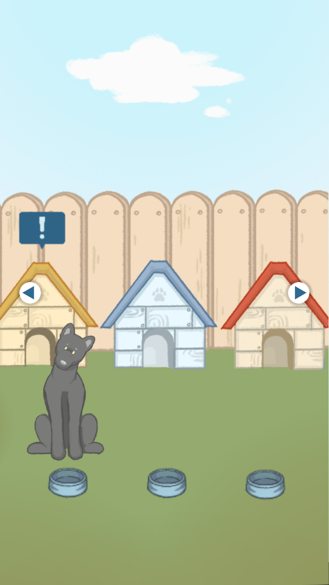
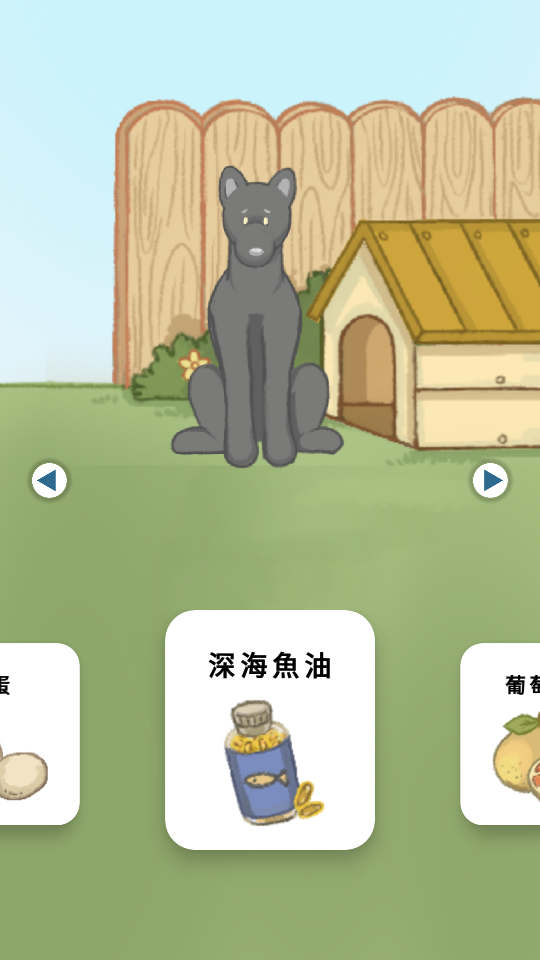
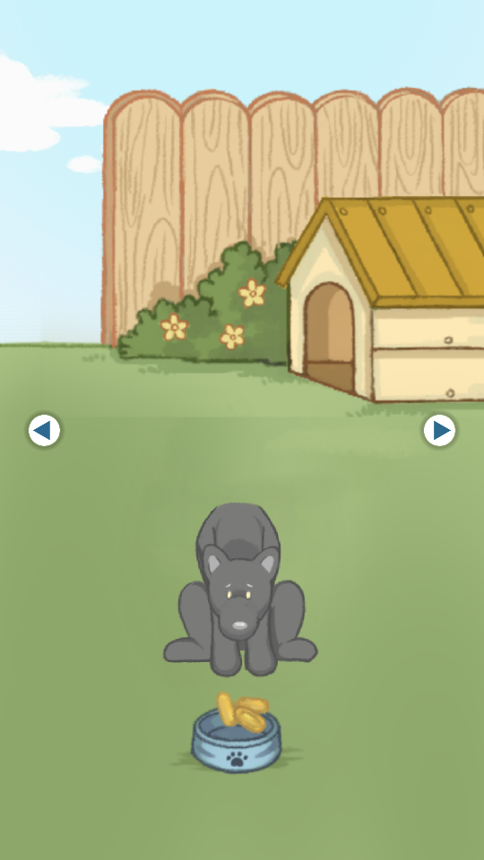

# Black-Dog-Lab

## Start

    

## Introduction

<table>
  <tr>
    <td>Introduction</td>
    <td>All Pages</td>
  </tr>
  <tr>
    <td></td>
    <td></td>
  </tr>
</table>

## All Pages

## Dog

## Dog
